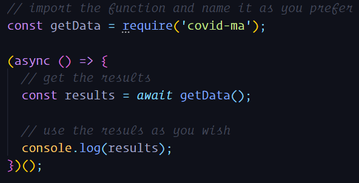
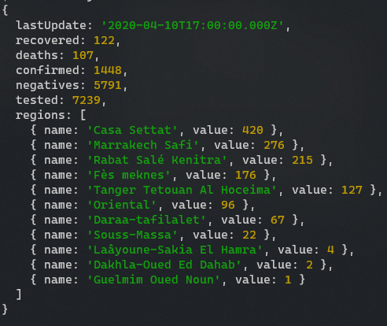

<h1 align="center">Welcome to covid-ma 👋  </h1>
<p align="center">
  
  <a href="https://github.com/Kafiil/covid-ma/blob/master/README.md" target="_blank">
    
  </a>
  <a href="#" target="_blank">
    
  </a>
  <a href="https://twitter.com/Kaaafiiil" target="_blank">
    
  </a>
</p>

> A small utility to get the latest Covid-19 statistics in Morocco from the [Official Website](http://www.covidmaroc.ma/pages/Accueil.aspx)

### 🏠 [Homepage](https://github.com/Kafiil/covid-ma)

## Install

```sh
npm install covid-ma
```

## Usage

### Demo



### Example result as of `2020-04-10T21:00:00.000Z`



## Author

👤 **Kafil Nasdami**

- Website: http://kafil.xyz
- Twitter: [@Kaaafiiil](https://twitter.com/Kaaafiiil)
- Github: [@kafiil](https://github.com/kafiil)
- LinkedIn: [@nkafil](https://linkedin.com/in/nkafil)

## 🤝 Contributing

Contributions, issues and feature requests are welcome!<br />Feel free to check [issues page](https://github.com/Kafiil/covid-ma/issues).

## Show your support

Give a ⭐️ if this project helped you!
